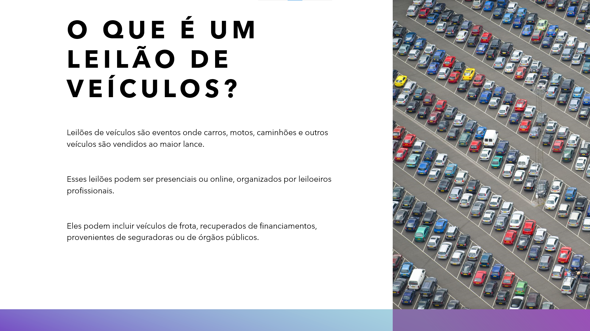
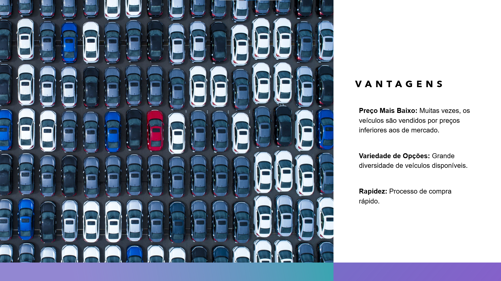
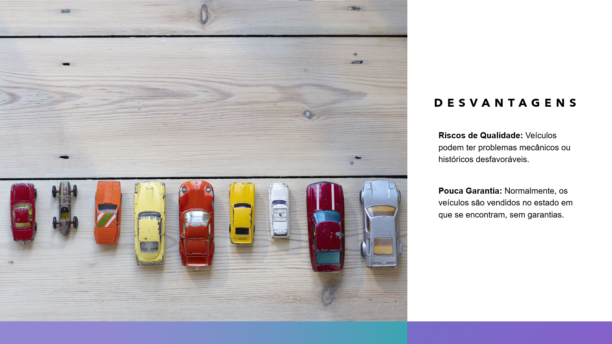
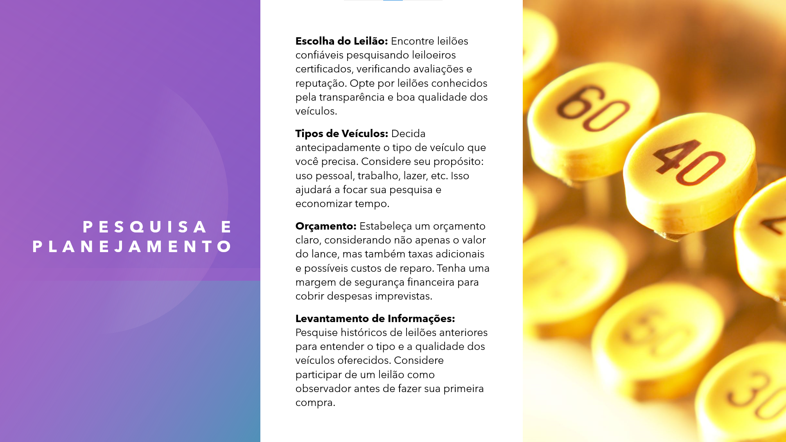
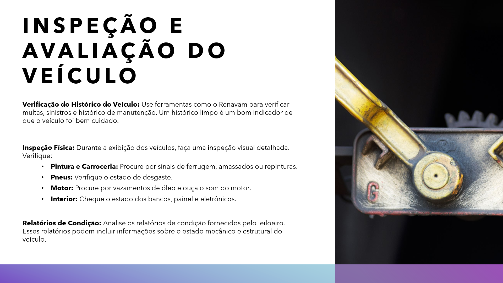
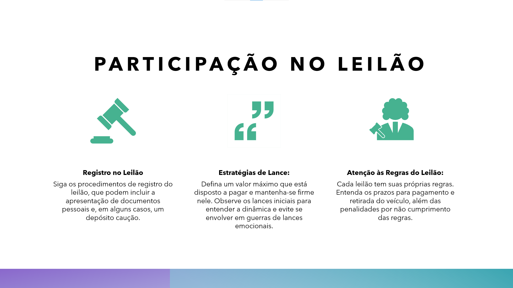
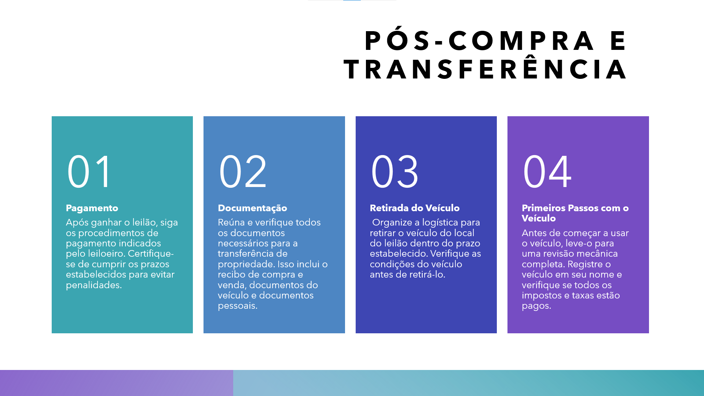
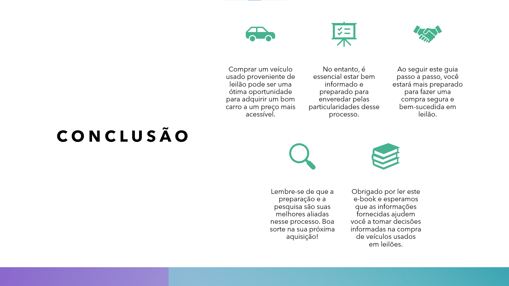

# Desafio de Projeto - Natural ou Fake Natty? Como Vencer na Era das IAs Generativas!

-green)

-blue)

 

## Índice

- [Descrição](#Descrição)
- [Tecnologias Utilizadas](#Tecnologias-Utilizadas)
- [Processo de Criação](#Processo-de-Criação)
- [Resultados](#Resultados)
- [Reflexão](#Reflexão)
- [Referências](#Referências)

 

## 📒 Descrição
Este e-book explora o impacto revolucionário das IAs Generativas no nosso dia a dia e como elas moldarão o futuro

 

## 🤖 Tecnologias Utilizadas
- Para criar o roteiro, utilizei o [ChatGPT](https://chatgpt.com/)
- Para criar os slides, utilizei o [Microsoft Copilot](https://designer.microsoft.com/)  integrado ao Power Point

 

## 🧐 Processo de Criação
- Em primeiro lugar, desenvolvi o roteiro com o ChatGPT, utilizando um prompt bem simples:
  
  > Gostaria que você me ajudasse a criar um e-book. O tema é: passo-a-passo comprar um veículo usado proveniente de leilão. Me dê o roteiro para alguns slides, abordando, em cada um deles, os principais pontos com os quais se preocupar durante a compra.

- Em seguida, iniciei uma apresentação em branco no Power Point, utilizando a ferramenta integrada de IA Copilot Desiner para me ajudar a diagramar e criar o design final. Esta ferramenta é fantástica!!!

 

## 🚀 Resultados
O e-book apresenta um conteúdo envolvente e visualmente rico, demonstrando como as IAs Genativas podem ser uma ferramenta poderosa na educação e na disseminação do conhecimento.

[Clique aqui para baixar o e-book](ebook_ia.pdf) e/ou veja-o a seguir:

 

## 💭 Reflexão
Muitos temem que a IA irá roubar seus empregos
 
Você provavelmente não será substituído pela IA e, sim, por alguém que saiba utilizá-la
 
Para não ser uma destas vítimas, invista em conhecimento
 
Não espere o trem da oportunidade passar.....

 

## Referências

Projeto Base (DIO): [Natural ou Fake Natty? Como Vencer na Era das IAs Generativas!](https://web.dio.me/project/natural-ou-fake-natty-como-vencer-na-era-das-ias-generativas/learning/95e52735-b8ac-4657-bd4b-0a9cf3c1a5db?back=/track/coding-future-vivo-python-ai-backend-developer&tab=undefined&moduleId=undefined)
