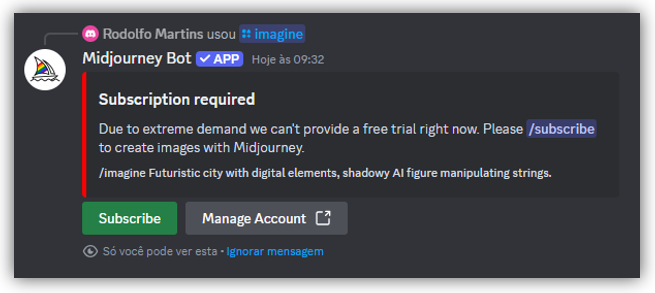
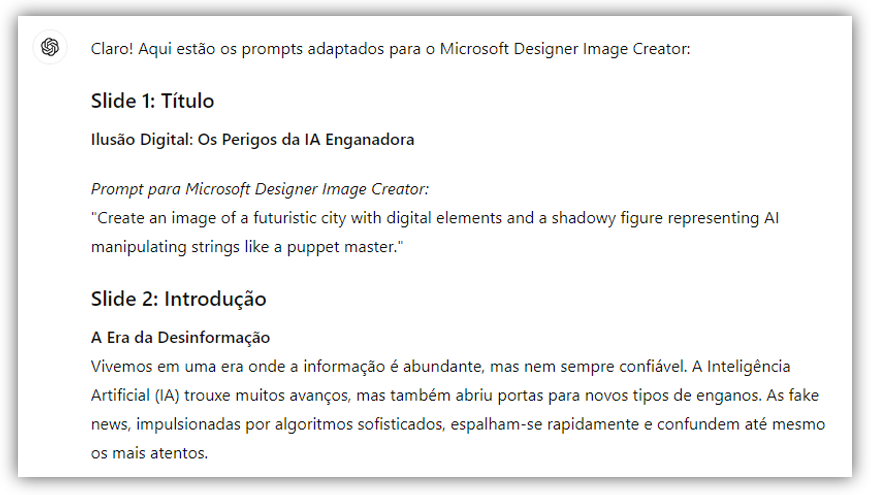

# Desafio de Projeto - Criando um Ebook com ChatGPT & MidJourney!

-green)

-blue)

 

## 📒 Descrição

Projeto realizado com o objetivo de gerar um ebook digital, utilizando as facilidades das ferramentas de Inteligência Artificial

 

## 💻 Tecnologias Utilizadas

- Para criar o roteiro, utilizei o [ChatGPT](https://chatgpt.com/)
- Para gerar as imagens, utilizei o [Microsoft Designer Image Creator](https://designer.microsoft.com/image-creator/)
- Para a diagramação, utilizei o [Microsoft PowerPoint](https://www.microsoft.com/en/microsoft-365/powerpoint)

> [!NOTE]
> A ideia original deste desafio era o utilizar o MidJourney para geração das imagens
>
> Porém, devido à alta demanda de utilização da mesma pela comunidade Discord, eu teria que assinar um plano pago para ter acesso, conforme print:
> 
> 
>
> Por este motivo, optei por utilizar, de forma alternativa, o *Microsoft Designer Image Creator*

 

## 🧠 Prompts e Desenvolvimento

Iniciei a interação com ChatGPT, contextualizando a minha demanda por meio do seguinte prompt:

~~~
Crie um título de um ebook sobre o tema de "Riscos de Sermos Enganados por IA".
O E-book é do nicho de "Tecnologia da Informação" e o subnicho é de "Fake News".
O título deve ser impactante e curto.
Me retorne algumas opções para eu escolher a melhor.
~~~

Como retorno, ele me apresentou uma relação com 5 títulos, na seguinte ordem:

~~~
1) "A Ascensão da IA: A Armadilha das Fake News"
2) "Ilusão Digital: Os Perigos da IA Enganadora"
3) "Verdade ou IA? Desvendando as Fake News"
4) "A Era da Desinformação: IA e Fake News"
5) "Enganos Virtuais: IA na Era das Fake News"
~~~

Gostei muito da 2ª opção apresentada e continuei o script, direcionando quais seriam os próximos passos:

~~~
Eu escolhi o 2º Título.
Agora me ajude a desenvolver o E-book, baseado nas {REGRAS} abaixo:

{REGRAS}
> O e-book deverá ter o primeiro slide com o título, 5 slides de desenvolvimento e 1 slide de conclusão
> Traga um texto simples e impactante para cada slide (do 1º até a conclusão)
> Irei utilizar o Midjourney para gerar as imagens
> Assim, para cada slide, me dê um prompt para eu gerar a imagem no Microsoft Designer Imagem Creator, refletindo
  o conteúdo do próprio slide
~~~

Para cada slide, o ChatGPT me retornou um título, um descritivo e um script, em inglês, para ser utilizado em outra ferramenta de IA para geração de imagens (*Microsoft Designer Imagem Creator*). Segue um exemplo do retorno:

> 

Esta é a relação de todos os prompts de geração de imagens gerados pelo ChatGPT, em inglês, com a sua respectiva tradução para o português:

| Slide | Prompt (Inglês) | Prompt (Português) |
| :---: | --------------- | ------------------ |
| 01 | *"Create an image of a futuristic city with digital elements and a shadowy figure representing AI manipulating strings like a puppet master."* | "Crie uma imagem de uma cidade futurista com elementos digitais e uma figura sombria representando IA manipulando cordas como um mestre de marionetes." |
| 02 | *"Design an image of a digital newsfeed with mixed headlines, showing a confused person and a glowing AI network in the background."* | "Desenhe uma imagem de um feed de notícias digital com manchetes variadas, mostrando uma pessoa confusa e uma rede de IA brilhando ao fundo." |
| 03 | *"Generate a side-by-side comparison of a real person and their deepfake counterpart with a digital interface highlighting AI's alterations, and binary code in the background."* | "Gere uma comparação lado a lado de uma pessoa real e sua contraparte deepfake com uma interface digital destacando as alterações da IA e código binário ao fundo." |
| 04 | *"Create an image of interconnected social media icons spreading like a digital explosion, with fake news symbols such as red alert signs and exclamation marks."* | "Crie uma imagem de ícones de redes sociais interconectados se espalhando como uma explosão digital, com símbolos de fake news, como sinais de alerta vermelho e pontos de exclamação." |
| 05 | *"Design a chaotic scene where people react to fake news on their devices, leading to protests, confusion, and panic, with a background contrast between calm, factual news outlets and the chaos caused by fake news."* | "Desenhe uma cena caótica onde as pessoas reagem a fake news em seus dispositivos, levando a protestos, confusão e pânico, com um fundo que contrasta entre fontes de notícias calmas e factuais e o caos causado por fake news." |
| 06 | *"Generate an image of diverse people holding up shields marked with symbols of truth and integrity, standing against a wave of digital misinformation, with elements of technology like servers and AI icons in the background."* | "Gere uma imagem de pessoas diversas segurando escudos marcados com símbolos de verdade e integridade, enfrentando uma onda de desinformação digital, com elementos de tecnologia como servidores e ícones de IA ao fundo." |
| 07 | *"Create a serene, hopeful scene of a digital landscape transitioning from chaos to order, with symbols of education, regulation, and ethical use of technology prominently displayed, and a clear blue sky in the background."* | "Crie uma cena serena e esperançosa de uma paisagem digital em transição do caos para a ordem, com símbolos de educação, regulamentação e uso ético da tecnologia em destaque, e um céu azul claro ao fundo." |

A última etapa foi a diagramação do conteúdo no bom e velho Power Point, deixando a imaginação fluir....

 

## 📚 Resultado Final

O resultado final é um e-book que apresenta um conteúdo envolvente e visualmente rico, demonstrando como as IAs Genativas podem ser uma ferramenta poderosa na educação e na disseminação do conhecimento.

[Clique aqui para baixar o e-book](Ebook_Fake_News.pdf) e/ou veja-o a seguir:

 
 
 
 

 

## 🔗 Referências

Projeto Base (DIO): [Criando um Ebook com ChatGPT & MidJourney](https://web.dio.me/project/criando-um-ebook-com-chatgpt-midjourney/learning/4ccf3a39-46fc-4ca7-8c26-17899e35da5b?back=/track/santander-2024-fundamentos-de-ia-para-devs&tab=undefined&moduleId=undefined)
