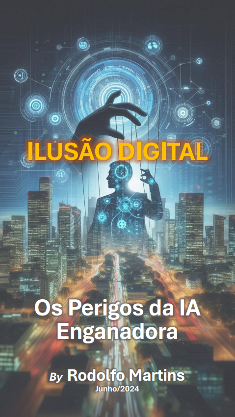
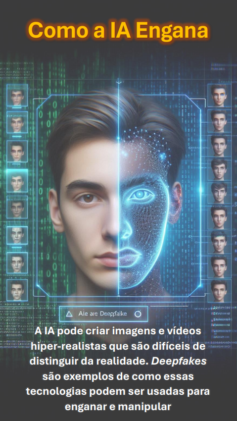

    

-------

# Projeto EBOOK Gerado por I.A.s

 > ℹ️ **NOTE:** Este é o repositório desenvolvido durante o curso no qual fui instrutor técnico na plataforma da [DIO](https://dio.me)

Projeto com o objetivo de gerar um ebook digital com as facilidades das ferramentas de IA. todos os prompts
seguem abaixo.

<a href="https://github.com/felipeAguiarCode/prompts-recipe-to-create-a-ebook/blob/main/output/ebook%20-%20css%20jedi%20output.pdf" title="View PDF now"> 📕Clique aqui para ler</a>

## 💻 Tecnologias utilizadas no projeto

- [ChatGPT](https://chat.openai.com/) 
- [MidJourney](https://www.midjourney.com/app/)
- [PowerPoint](https://www.microsoft.com/en/microsoft-365/powerpoint)

## 🧠 Prompts

ChatGPT：

| Slide | Prompt (Inglês) | Prompt (Português) |
| :---: | --------------- | ------------------ |
| 01 | *"Create an image of a futuristic city with digital elements and a shadowy figure representing AI manipulating strings like a puppet master."* | "Crie uma imagem de uma cidade futurista com elementos digitais e uma figura sombria representando IA manipulando cordas como um mestre de marionetes." |
| 02 | *"Design an image of a digital newsfeed with mixed headlines, showing a confused person and a glowing AI network in the background."* | "Desenhe uma imagem de um feed de notícias digital com manchetes variadas, mostrando uma pessoa confusa e uma rede de IA brilhando ao fundo." |
| 03 | *"Generate a side-by-side comparison of a real person and their deepfake counterpart with a digital interface highlighting AI's alterations, and binary code in the background."* | "Gere uma comparação lado a lado de uma pessoa real e sua contraparte deepfake com uma interface digital destacando as alterações da IA e código binário ao fundo." |
| 04 | *"Create an image of interconnected social media icons spreading like a digital explosion, with fake news symbols such as red alert signs and exclamation marks."* | "Crie uma imagem de ícones de redes sociais interconectados se espalhando como uma explosão digital, com símbolos de fake news, como sinais de alerta vermelho e pontos de exclamação." |
| 05 | *"Design a chaotic scene where people react to fake news on their devices, leading to protests, confusion, and panic, with a background contrast between calm, factual news outlets and the chaos caused by fake news."* | "Desenhe uma cena caótica onde as pessoas reagem a fake news em seus dispositivos, levando a protestos, confusão e pânico, com um fundo que contrasta entre fontes de notícias calmas e factuais e o caos causado por fake news." |
| 06 | *"Generate an image of diverse people holding up shields marked with symbols of truth and integrity, standing against a wave of digital misinformation, with elements of technology like servers and AI icons in the background."* | "Gere uma imagem de pessoas diversas segurando escudos marcados com símbolos de verdade e integridade, enfrentando uma onda de desinformação digital, com elementos de tecnologia como servidores e ícones de IA ao fundo." |
| 07 | *"Create a serene, hopeful scene of a digital landscape transitioning from chaos to order, with symbols of education, regulation, and ethical use of technology prominently displayed, and a clear blue sky in the background."* | "Crie uma cena serena e esperançosa de uma paisagem digital em transição do caos para a ordem, com símbolos de educação, regulamentação e uso ético da tecnologia em destaque, e um céu azul claro ao fundo." |

Midjourney：

|  Ação  | prompt                                                                                 |
| :----: | -------------------------------------------------------------------------------------- |
| título | A jedi in meditation pose, with your blue lightsaber floating, pixel art style --v 5.1 |

## ✨ Features

- Conteúdo gerado via ChatGPT
- Imagens geradas via MidJourney

## 📚 Materiais

- Imagens utilizadas em `assets`
- ebook gerado durante as aulas em `output`

## 🛠️ Resultado

O e-book apresenta um conteúdo envolvente e visualmente rico, demonstrando como as IAs Genativas podem ser uma ferramenta poderosa na educação e na disseminação do conhecimento.

Clique aqui para baixar o e-book e/ou veja-o a seguir:

 
 
 
 

## 👨‍💻 Expert

    
    
&nbsp&nbsp&nbspFelipe Aguiar 
    &nbsp&nbsp&nbsp
    <a href="https://github.com/felipeAguiarCode">
    GitHub</a>&nbsp;|&nbsp;
    <a href="www.linkedin.com/in/
felipe-exe">LinkedIn</a>
&nbsp;|&nbsp;
    <a href="https://www.instagram.com/felipeaguiar.exe/">
    Instagram</a>
&nbsp;|&nbsp;

  

---

⌨️ com 💜 por [Felipe Aguiar](https://github.com/felipeAguiarCode)
