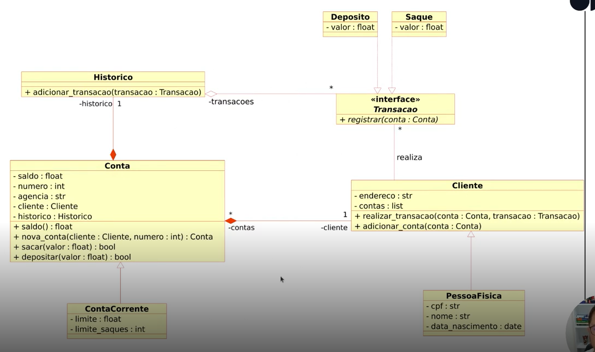

# Desafio de Projeto - Modelando o Sistema Bancário em POO com Python

-green)

-blue)

 

## Índice

- [Objetivo](#Objetivo)
- [Requisitos](#Requisitos)
- [Análise do Diagrama UML](#Análise-do-Diagrama-UML)
- [Resolução](#Resolução)
- [Referências](#Referências)

 

## Objetivo

Iniciar a modelagem do sistema bancário otimizado no [Desafio de Projeto 002](https://github.com/rodolfoom1982/treinamentos/tree/main/dio-dominando-python-e-suas-estruturas-de-dados/Desafio%20de%20Projeto%20002%20-%20Otimizando%20o%20sistema%20banc%C3%A1rio%20com%20fun%C3%A7%C3%B5es%20Python), utilizando POO (Programação Orientada a Objetos)

 

## Requisitos

1) Adicionar classes para ***cliente*** e para as operações bancárias ***depositar*** e ***sacar***;
2) Atualizar a implementação do sistema para armazenar os dados de clientes e contas bancárias em objetos e não mais em dicionários;
3) O código deverá respeitar o seguinte diagrama UML:
        >

4) ***Desafio Extra***: ao concluir a modelagem das classes e a criação dos métodos, atualizar os métodos que tratam da as opções do ***menu***, de modo que funcionem com as classes modeladas

 

## Análise do Diagrama UML

> [!NOTE]
> Antes de apresentar a resolução do desafio, segue um entendimento de contexto sobre o diagrama UML apresentado anteriormente

**Classes e Relacionamentos**

1) **Historico()**
   - ***Métodos***:
     - **adicionar_transacao(transacao *<kbd>Transacao()</kbd>*)**: Adiciona uma transação ao histórico
   - ***Relacionamentos***:
     - Uma instância de <kbd>Historico()</kbd> tem um relacionamento 1:N com <kbd>Transacao()</kbd>, ou seja, um histórico pode ter várias transações

2) **Transacao(Interface)**
   - ***Métodos***:
     - **registrar(conta *<kbd>Conta()</kbd>*)**: Método para registrar uma transação em uma conta
   - ***Relacionamentos***:
     - <kbd>Transacao()</kbd> é uma interface implementada pelas classes <kbd>Deposito()</kbd> e <kbd>Saque()</kbd>

3) **Deposito()**
   - ***Atributos***:
     - **valor**: Valor do depósito (formato: *float*)
   - ***Métodos***:
     - Herda o método **registrar** da interface <kbd>Transacao()</kbd>
   - ***Relacionamentos***:
     - É uma especialização (herança) de <kbd>Transacao()</kbd>

4) **Saque()**
   - ***Atributos***:
     - **valor**: Valor do saque (formato: *float*)
   - ***Métodos***:
     - Herda o método **registrar** da interface <kbd>Transacao()</kbd>
   - ***Relacionamentos***:
     - É uma especialização (herança) de <kbd>Transacao()</kbd>

5) **Conta()**
   - ***Atributos***:
     - **saldo**: Saldo da conta (formato: *float*);
     - **numero**: Número da conta (formato: *int*);
     - **agencia**: Agência da conta (formato: *str*);
     - **cliente**: Cliente associado à conta (formato: <kbd>Cliente()</kbd>);
     - **historico**: Histórico de transações da conta (formato: <kbd>Historico()</kbd>)
   - ***Métodos***:
     - **saldo() return *float***: Retorna o saldo da conta;
     - **nova_conta(cliente *<kbd>Cliente()</kbd>*, numero *int*) return *<kbd>Conta()</kbd>***: Cria uma nova conta para um cliente;
     - **sacar(valor *float*) return *bool***: Realiza um saque na conta;
     - **depositar(valor *float*) return *bool***: Realiza um depósito na conta
   - ***Relacionamentos***:
     - Uma instância de <kbd>Conta()</kbd> está associada a um cliente;
     - Uma instância de <kbd>Conta()</kbd> possui um histórico que mantém um registro das transações;
     - Um cliente pode ter várias contas

6) **Cliente()**
   - ***Atributos***:
     - **endereco**: Endereço do cliente (formato: *str*);
     - **contas**: Lista de contas do cliente (formato: *list*)
   - ***Métodos***:
     - **realizar_transacao(conta: *<kbd>Conta()</kbd>*, transacao: *<kbd>Transacao()</kbd>*)**: Realiza uma transação em uma conta específica;
     - **adicionar_conta(conta: *<kbd>Conta()</kbd>*)**: Adiciona uma conta à lista de contas do cliente
   - ***Relacionamentos***:
     - Um cliente pode ter várias contas;
     - O cliente realiza transações

7) **ContaCorrente()**
   - ***Atributos***:
     - **limite**: Limite de crédito da conta corrente (formato: *float*);
     - **limite_saques**: Limite de saques permitido (formato: *int*)
   - ***Relacionamentos***:
     - É uma especialização (herança) de <kbd>Conta()</kbd>.

8) **PessoaFisica**()
   - ***Atributos***:
     - **cpf**: CPF do cliente (formato: *str*);
     - **nome**: Nome do cliente (formato: *str*);
     - **data_nascimento**: Data de nascimento do cliente (formato: *date*)
   - ***Relacionamentos***:
     - É uma especialização (herança) de <kbd>Cliente()</kbd>

 

**Relacionamentos no Diagrama**

1) **<kbd>Histórico()</kbd> <-> <kbd>Transacao()</kbd>**:
   - Um historico pode conter múltiplas transações

2) **<kbd>Conta()</kbd> <-> <kbd>Cliente()</kbd>**:
   - Uma conta está associada a um único cliente;
   - Um cliente pode ter múltiplas contas

3) **<kbd>Transacao()</kbd> <-> <kbd>Conta()</kbd>**:
   - Uma transação é realizada em uma conta específica

 

**Conceitos de POO encontrados no diagrama**

1) **Classes e Objetos**
   - As classes representam entidades do sistema e seus comportamentos;
   - No diagrama, temos classes como <kbd>Conta()</kbd>, <kbd>Cliente()</kbd>, <kbd>Transacao()</kbd>, <kbd>Deposito()</kbd>, <kbd>Saque()</kbd>, <kbd>Historico()</kbd>, <kbd>ContaCorrente()</kbd> e <kbd>PessoaFisica()</kbd>;
   - Cada instância dessas classes é um objeto que possui os atributos e métodos definidos na classe

3) **Encapsulamento**
   - O encapsulamento é a prática de esconder os detalhes internos de uma classe e expor apenas o que é necessário;
   - No diagrama, cada classe tem atributos privados (não explicitamente marcado, mas implícito pelo design) e métodos públicos que operam nesses atributos;
   - Por exemplo, os atributos **saldo**, **numero**, **agencia**, **cliente**, e **historico** na classe <kbd>Conta()</kbd> são manipulados por métodos como **sacar**, **depositar** e **nova_conta**

5) **Herança**
   - Herança é o mecanismo pelo qual uma classe pode herdar atributos e métodos de outra classe. No diagrama, temos:
     - <kbd>Deposito()</kbd> e <kbd>Saque()</kbd> herdam de <kbd>Transacao()</kbd>;
     - <kbd>ContaCorrente()</kbd> herda de <kbd>Conta()</kbd>;
     - <kbd>PessoaFisica()</kbd> herda de <kbd>Cliente()</kbd>
   - Isso permite que as classes derivadas (subclasses) reutilizem o código das classes base (superclasses) e, ao mesmo tempo, adicionem e/ou modifiquem funcionalidades

4) **Polimorfismo**
   - Polimorfismo permite que um mesmo método possa se comportar de maneiras diferentes dependendo do objeto que o invoca. No diagrama, temos:
     - <kbd>Transacao()</kbd> é uma interface com o método registrar que é implementado de forma diferente em <kbd>Deposito()</kbd> e <kbd>Saque()</kbd>;
     - **realizar_transacao** em <kbd>Cliente()</kbd> pode aceitar diferentes tipos de transações (<kbdDeposito()</kbd> ou <kbd>Saque()</kbd>), mostrando o polimorfismo em ação

5) **Associação**
   - Associação define um relacionamento entre duas classes. No diagrama, temos:
     - <kbd>Conta()</kbd> está associada a <kbd>Cliente()</kbd> e <kbd>Historico()</kbd>;
     - <kbd>Cliente()</kbd> pode ter várias <kbd>Conta()</kbd>;
     - <kbd>Historico()</kbd> pode ter várias <kbd>Transacao()</kbd>.

6) **Composição**
   - Composição é um tipo de associação onde uma classe contém a outra e controla seu ciclo de vida. No diagrama, temos:
     - <kbd>Conta()</kbd> contém um <kbd>Historico()</kbd> e a existência do <kbd>Historico()</kbd> depende da <kbd>Conta()</kbd>;
     - <kbd>Historico()</kbd> contém <kbdTransacao()</kbd> e controla o ciclo de vida das transações

7) **Agregação**
   - Agregação é uma forma de associação que representa um relacionamento "tem-um". Por exemplo, o <kbd>Cliente()</kbd> tem um endereço e uma lista de contas, mas as contas podem existir independentemente do cliente

8) **Abstração**
   - Abstração é o processo de ocultar os detalhes complexos e mostrar apenas a essência. No diagrama, temos:
     - <kbd>Transacao()</kbd> é uma classe abstrata representando a ideia geral de uma transação;
     - <kbd>Deposito()</kbd> e <kbd>Saque()</kbd> são implementações específicas de <kbd>Transacao()</kbd>

 

## Resolução

~~~Python
from datetime import date
from typing import List

# Classe base para transações
class Transacao:
  def __init__(self, valor: float):
    self.valor = valor
  
  def registrar(self, conta: 'Conta'):
    raise NotImplementedError("Método deve ser implementado nas subclasses")

# Classe para depósitos, herda de Transacao
class Deposito(Transacao):
  def registrar(self, conta: 'Conta'):
    conta.saldo += self.valor
    conta.historico.adicionarTransacao(self)

# Classe para saques, herda de Transacao
class Saque(Transacao):
  def registrar(self, conta: 'Conta'):
    if conta.saldo >= self.valor:
      conta.saldo -= self.valor
      conta.historico.adicionarTransacao(self)
      return True
    return False

# Classe para histórico de transações
class Historico:
  def __init__(self):
    self.transacoes: List[Transacao] = []
  
  def adicionarTransacao(self, transacao: Transacao):
    self.transacoes.append(transacao)

# Classe para contas bancárias
class Conta:
  def __init__(self, numero: int, agencia: str, cliente: 'Cliente'):
    self.saldo = 0.0
    self.numero = numero
    self.agencia = agencia
    self.cliente = cliente
    self.historico = Historico()
  
  def saldo(self) -> float:
    return self.saldo
  
  @classmethod
  def novaConta(cls, cliente: 'Cliente', numero: int) -> 'Conta':
    return cls(numero, "0001", cliente)
  
  def sacar(self, valor: float) -> bool:
    saque = Saque(valor)
    return saque.registrar(self)
  
  def depositar(self, valor: float) -> bool:
    deposito = Deposito(valor)
    deposito.registrar(self)
    return True

# Classe para clientes
class Cliente:
  def __init__(self, endereco: str):
    self.endereco = endereco
    self.contas: List[Conta] = []
  
  def realizar_transacao(self, conta: Conta, transacao: Transacao):
    transacao.registrar(conta)
  
  def adicionar_conta(self, conta: Conta):
    self.contas.append(conta)

# Classe para conta corrente, herda de Conta
class ContaCorrente(Conta):
  def __init__(self, numero: int, agencia: str, cliente: Cliente, limite: float, limiteSaques: int):
    super().__init__(numero, agencia, cliente)
    self.limite = limite
    self.limiteSaques = limiteSaques

# Classe para pessoas físicas, herda de Cliente
class PessoaFisica(Cliente):
  def __init__(self, cpf: str, nome: str, dataNascimento: date, endereco: str):
    super().__init__(endereco)
    self.cpf = cpf
    self.nome = nome
    self.dataNascimento = dataNascimento

# Exemplo de uso
cliente = PessoaFisica("123.456.789-00", "Rodolfo Martins", date(1990, 1, 1), "Rua Exemplo, 123")
conta = Conta.novaConta(cliente, 1001)
cliente.adicionar_conta(conta)

# Realiza um depósito
conta.depositar(200.0)

# Realiza um saque
conta.sacar(50.0)

# Imprime saldo e histórico de transações
print(f"\nSaldo atual: R${conta.saldo}")

print('\nTransações:')

for transacao in conta.historico.transacoes:
  print(f"\t{'Depósito' if isinstance(transacao, Deposito) else 'Saque'} de R${transacao.valor:.2f}")
~~~

 

## Referências

Projeto Base (DIO): [Modelando o Sistema Bancário em POO com Python](https://web.dio.me/project/modelando-o-sistema-bancario-em-poo-com-python/learning/92139fbc-dd1f-44c2-a9dc-61859f246f60?back=/track/coding-future-vivo-python-ai-backend-developer&tab=undefined&moduleId=undefined)
