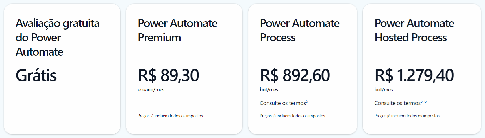
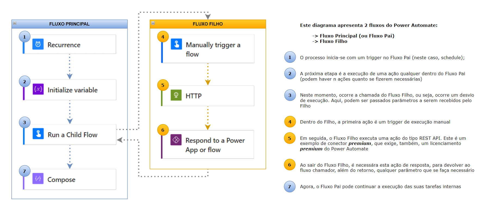

# Desafio de Projeto - Criando Artigos Técnicos com ChatGPT e LexicaArt

-green)

-blue)

 

## 📒 Descrição

Projeto realizado com o objetivo de criar um artigo técnico, utilizando as facilidades das ferramentas de Inteligência Artificial e o discernimento humano para o processo construtivo e revisional

 

## 💻 Tecnologias Utilizadas

- Para criar o roteiro, utilizei o [ChatGPT](https://chatgpt.com/)
- Para gerar a imagem de capa, utilizei a [LexicaArt](https://lexica.art/)
- Para a diagramação, utilizei o [Microsoft PowerPoint](https://www.microsoft.com/en/microsoft-365/powerpoint) e o [draw.io](https://app.diagrams.net/)

 

## 🧠 Prompts e Desenvolvimento
Antes de mais nada, defini um tema para meu artigo. Como gosto muito do Microsoft Power Automate e já me deparei com problemas de limitação de licenciamento, resolvir abordar este tema, apresentando uma solução que pode ser útil a outras pessoas: ***Power Automate: Utilização de Fluxos Filhos Para Redução do Volume de Licenciamento Premium***.

Tema definido, iniciei a interação com ChatGPT, contextualizando a minha demanda por meio do seguinte prompt:

~~~
Aja com se você fosse um escritor de artigos tech para Engenharia de Dados e escreva
o artigo atendendo as {REGRAS} abaixo:

{REGRAS}
- Cada bloco dever ter, no máximo, 5 linhas de explicação
- Inicie o artigo com uma saudação
- Fale de maneira informal, como se estivesse se direcionando a um Engenheiro de Dados Júnior
- Os blocos a serem criados estão listados abaixo:

	1) O que é o Power Automate
	2) Como funciona o licenciamento premium
		- Cite exemplos dos principais conectores premiuns
	3) O que são fluxos filhos (child flows)
	4) Como os fluxos filhos reduzem o volume de licenciamento premium
	5) Coloque 2 hashtags que estejam relacionadas ao tema

- Ao final do artigo, inclua os créditos abaixo

Ilustração de capa: gerada por meio da Lexica.art
Conteúdo: gerado através do ChatGPT e por revisões humanas
~~~

O retorno do ChatGPT foi fantástico! Mas sentia a necessidade de inclusão das vantagens relacionadas ao uso dos fluxos filhos. Assim, solicitei um complemente ao ChatGTP:

~~~
Crie mais um bloco falando sobre as vantagens de se utilizar fluxos filhos
~~~

Perfeito!

A última etapa, em termos de escrita, foi aprofundar a questão de custos de licenciamento do Power Platform. Optei por ir eu mesmo ao site da Microsoft e coletar esta informação, consolidando em uma imagem (afinal, as imagens valem mais do que mil palavras):

> 

Achei que valia à pena desenhar, também, um diagrama para exemplificar o relacionamento entre fluxos pai e filho, pois muitos leitores tem mais facilidade visual de entendimento. Assim, criei o diagrama abaixo:

> 

Pronto!

A última etapa foi a diagramação do conteúdo em um arquivo MD (markdown), disponibilizado aqui no próprio Github.

 

## 📚 Resultado Final

O resultado final é artigo bem embasado, com uma leitura leve e direta, que pode ajudar a muitas pessoas na resolução dos mesmos problemas de limites de licenciamento que enfreitei

[Clique aqui](artigoPowerAutomate.md) para acessa o artigo no Github ou [aqui](https://web.dio.me/articles/utilizacao-de-fluxos-filhos-no-microsoft-power-automate?back=%2Farticles&page=1&order=oldest) para acessá-lo no Dio.me

 

## 🔗 Referências

Projeto Base (DIO): [Criando Artigos Técnicos com ChatGPT e Lexica.art](https://web.dio.me/project/criando-artigos-tecnicos-com-chatgpt-e-lexicaart/learning/b3a4c522-07a4-4697-ae0d-3fdf6add2c22?back=/track/santander-2024-fundamentos-de-ia-para-devs&tab=undefined&moduleId=undefined)
